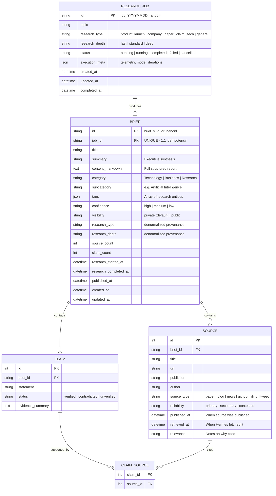

# Bugle: Architecture & Migration Plan (v2)
*Personal Research Intelligence Platform*

> "Hermes investigates. Bugle publishes and remembers."

---

## 1. System Topology & Security Invariants

Bugle is the durable research archive and evidence-backed publishing layer for investigations conducted by **Hermes**.

```
                        ┌───────────────┐
                        │   TELEGRAM    │  (Incoming signal / research request)
                        └───────┬───────┘
                                │
                                ▼
                        ┌───────────────┐
                        │    HERMES     │
                        │               │
                        │ Interpretation│
                        │ Research      │
                        │ Verification  │
                        │ Synthesis     │
                        └───────┬───────┘
                                │
               ┌────────────────┴────────────────┐
               │                                 │
     1. POST /api/v1/jobs              2. POST /api/v1/briefs
        (Async Job Init)                  (Idempotent Publication)
               │                                 │
               │   Bearer BUGLE_SERVICE_TOKEN    │
               ▼                                 ▼
┌────────────────────────────────────────────────────────┐
│                        BUGLE                           │
│      FastAPI · SQLite (WAL) · React 19 (launchd)       │
│                                                        │
│  • Jobs Lifecycle        • Claim ↔ Source Evidence Map │
│  • Briefs Archive        • Research Taxonomies         │
│  • Provenance Audit      • Safe Markdown Rendering     │
└───────────────────────────┬────────────────────────────┘
                            │
              Strict Invariant: Origin binds to
                  127.0.0.1:<port> ONLY.
             Never exposed directly to Internet.
                            │
                            ▼
              ┌───────────────────────────┐
              │     CLOUDFLARE TUNNEL     │
              └─────────────┬─────────────┘
                            │
                            ▼
              ┌───────────────────────────┐
              │     CLOUDFLARE ACCESS     │
              │  (bugle.gauravs-apps.in)  │
              └─────────────┬─────────────┘
                            │
             ┌──────────────┴──────────────┐
             │                             │
             ▼                             ▼
   ┌───────────────────┐         ┌───────────────────┐
   │  HUMAN OPERATOR   │         │ ANONYMOUS PUBLIC  │
   │ Cloudflare Access │         │ Public Briefs Only│
   │  Identity Header  │         │(or 403 in Phase 1)│
   └───────────────────┘         └───────────────────┘
```

### Critical Security & Origin Invariants
1. **Origin Isolation**: Bugle binds strictly to `127.0.0.1:8480`. It has **no public inbound port** open on the host machine.
2. **Access Path**: External traffic reaches Bugle exclusively through the authenticated Cloudflare Tunnel. Therefore, the `Cf-Access-Authenticated-User-Email` header is protected from direct external spoofing.
3. **Machine Ingestion**: Hermes communicates over internal loopback or through the tunnel using `Authorization: Bearer <BUGLE_SERVICE_TOKEN>`.
4. **Zero Browser Token Storage**: No long-lived admin API token is ever stored in browser `localStorage`. Human authentication is governed by Cloudflare Access session cookies.
5. **Safe Fail Default**: Anonymous callers are restricted at the database query level to `visibility == "public"`. If `BUGLE_PUBLIC_ENABLED=false` (Phase 1 default), anonymous requests are rejected outright (404/403).

---

## 2. Domain Model & Relational Schema



### Research Depth Quality Targets
- **Fast**: ~3–5 sources. Prioritizes official primary source (repo, announcement). Basic verification, concise synthesis.
- **Standard**: ~5–10 sources. Primary + credible secondary reporting. Claim verification, contradiction detection, architectural context.
- **Deep**: 10+ sources where appropriate. Multiple primary sources, historical context, independent corroboration, complete claim-to-source evidence mapping, explicit uncertainty/risk analysis.

### Research Types
- `product_launch`
- `company_announcement`
- `github_project`
- `research_paper`
- `media_claim`
- `technical_topic`
- `general`

---

## 3. Asynchronous Lifecycle & Idempotency Guarantee

### Research Job Lifecycle
```
[POST /jobs] ──► PENDING ──► RUNNING ──► COMPLETED ──► [POST /briefs] ──► PUBLISHED
                                │
                                └──► FAILED / CANCELLED
```
Job status (`completed`) is strictly decoupled from Brief publication status (`published`), enabling auditability if an investigation succeeds but publication is retried.

### Idempotency Invariant
To prevent network timeouts or autonomous retries from duplicating briefs:
1. `brief.job_id` is defined as `UNIQUE` in the database schema.
2. `POST /api/v1/briefs` accepts an optional `Idempotency-Key` header (defaulting to the payload's `job_id`).
3. If a brief with that `job_id` already exists, Bugle returns **HTTP 200 OK** with the existing brief record rather than inserting a duplicate or throwing an unhandled conflict.

---

## 4. API Endpoints (`/api/v1`)

### Hermes Machine Endpoints (Bearer `BUGLE_SERVICE_TOKEN`)
- `POST /api/v1/jobs`:
  - Registers a new research job.
  - Body: `{ topic, research_type, research_depth, execution_meta }`
  - Returns: `201 Created` with `{ id: "job_...", status: "pending" }`.
- `PATCH /api/v1/jobs/{id}`:
  - Updates status (`running`, `completed`, `failed`), error logs, or execution metadata.
- `GET /api/v1/jobs/{id}`:
  - Inspects job progress and metadata.
- `POST /api/v1/briefs`:
  - Idempotently publishes research results.
  - Payload supports inline creation of `sources`, `claims`, and `claim_source_mappings`:
    ```json
    {
      "job_id": "job_20260905_01",
      "title": "DeepSeek R1 Architecture & Distillation",
      "summary": "Technical review of GRPO-driven reasoning and open distillation...",
      "content_markdown": "# DeepSeek R1 Overview\n\n...",
      "category": "Technology",
      "subcategory": "Artificial Intelligence",
      "tags": ["deepseek", "reasoning", "open-weights"],
      "confidence": "high",
      "visibility": "private",
      "research_type": "technical_topic",
      "research_depth": "deep",
      "research_started_at": "2026-09-05T18:30:00Z",
      "research_completed_at": "2026-09-05T18:45:00Z",
      "sources": [
        {
          "temp_id": "src_1",
          "title": "DeepSeek-R1 Technical Report",
          "url": "https://arxiv.org/abs/2501.12948",
          "publisher": "arXiv",
          "source_type": "paper",
          "reliability": "primary",
          "retrieved_at": "2026-09-05T18:32:00Z"
        }
      ],
      "claims": [
        {
          "statement": "Large-scale pure RL yields emergent reasoning behaviors without SFT warm-up.",
          "status": "verified",
          "evidence_summary": "Confirmed in Section 3.1 ablation experiments of R1-Zero.",
          "source_temp_ids": ["src_1"]
        }
      ]
    }
    ```

### UI & Operator Endpoints (Cloudflare Access or Public)
- `GET /api/v1/briefs`:
  - Parameters: `search`, `category`, `subcategory`, `tag`, `limit`, `offset`.
  - **Server-side auth filter**: Automatically scopes query to `visibility == "public"` if unauthenticated.
- `GET /api/v1/briefs/{id}`:
  - Returns complete brief with linked sources, claims, and claim ↔ source associations.
  - Returns 404 if private and caller is unauthenticated.
- `PATCH /api/v1/briefs/{id}`: (Admin only)
  - Toggle visibility (`private` ↔ `public`), modify category or tags.
- `DELETE /api/v1/briefs/{id}`: (Admin only)
  - Remove brief.
- `GET /api/v1/auth/me`:
  - Returns caller identity `{ role: "admin" | "anonymous", email: "..." }`.
- `GET /api/health`:
  - Public healthcheck returning `{ status: "ok", app: "bugle", version: "..." }`.

---

## 5. V1 Frontend: Focus on Reading & Auditability

To avoid over-engineering, V1 delivers a lean, distraction-free reading experience:

```
┌─────────────────────────────────────────────────────────────────┐
│ 🎺 BUGLE            [ Search briefs... ]      👤 gauravs (Admin)│
├─────────────────────────────────────────────────────────────────┤
│ Recent Investigations                                           │
│                                                                 │
│ 📄 DeepSeek R1 Architecture & Distillation                      │
│    Technology / AI · Deep · High Confidence                     │
│    2 hours ago · 4 primary sources · 3 verified claims          │
│    Executive Summary: Comprehensive evaluation of reasoning... │
│    [deepseek] [reasoning] [open-weights]              🔒 Private│
│                                                                 │
│ 📄 Liquid Neural Networks in Robotics                           │
│    Research / Robotics · Standard · Medium Confidence           │
│    Yesterday · 2 sources · 1 verified claim                     │
│    Executive Summary: Continuous-time recurrent models...       │
│    [liquid-ai] [edge]                                 🌐 Public │
└─────────────────────────────────────────────────────────────────┘
```

When clicking an investigation:
- **Header**: Title, Research Depth badge, Confidence, Category, and Provenance timestamp.
- **Executive Summary**: Highlighted briefing block.
- **Rendered Markdown Body**: Rendered via `react-markdown` + `remark-gfm` supporting tables, code fences, blockquotes, and sanitized outbound links.
- **Claims Verification Box**: List of claims with color-coded status badges (`verified`, `contradicted`, `unverified`), evidence summary, and direct links to supporting sources.
- **Primary Sources Drawer**: Full source list showing publisher, publication date, retrieval date, and reliability indicator.

---

## 6. Deployment Pipeline & Verification

Updated [scripts/trigger_deploy.sh](file:///Users/gauravsingh/projects/bugle/scripts/trigger_deploy.sh):

```bash
#!/usr/bin/env bash
set -euo pipefail
ROOT="$(cd "$(dirname "$0")/.." && pwd)"
cd "$ROOT"

echo "[bugle] taking pre-deployment sqlite backup..."
mkdir -p data/backups
if [ -f data/bugle.db ]; then
  cp data/bugle.db "data/backups/bugle-$(date +%Y%m%d_%H%M%S).db"
fi

echo "[bugle] pulling git updates..."
git pull --ff-only --quiet

echo "[bugle] installing backend dependencies..."
./.venv/bin/pip install -q -e ".[dev]"

echo "[bugle] applying database migrations..."
./.venv/bin/python -m bugle.db_migrate

echo "[bugle] building frontend (npm ci + build)..."
if [ -d web ] && [ -f web/package-lock.json ]; then
  (cd web && npm ci && npm run build)
fi

echo "[bugle] restarting launchd service..."
launchctl kickstart -k "gui/$(id -u)/com.personal.bugle" 2>/dev/null \
  || launchctl unload ~/Library/LaunchAgents/com.personal.bugle.plist \
  && launchctl load ~/Library/LaunchAgents/com.personal.bugle.plist

echo "[bugle] verifying daemon health check..."
sleep 2
HEALTH_URL="http://127.0.0.1:8480/api/health"
if curl --silent --fail --max-time 10 "$HEALTH_URL" > /dev/null; then
  echo "[bugle] health check passed. Deployment SUCCESSFUL."
else
  echo "[bugle] ERROR: health check failed on $HEALTH_URL" >&2
  exit 1
fi
```

---

## 7. Phased Implementation Roadmap

### Phase 0 — Repository & Data Audit *(Completed)*
- Verified existing SQLite database `data/bugle.db`.
- Confirmed `web/package-lock.json` is committed.
- Validated origin binding and macOS launchd setup.

### Phase 1 — Domain Model & Database Schema *(Completed)*
- Implemented SQLAlchemy models in [`db.py`](file:///Users/gauravsingh/projects/bugle/src/bugle/db.py): `ResearchJob`, `Brief`, `Source`, `Claim`, `ClaimSource`, `BriefRevision`.
- Created automated additive migration runner (`src/bugle/db_migrate.py` and `db.py::Database.session`).
- Enabled SQLite WAL mode, foreign keys (`PRAGMA foreign_keys = ON`), `busy_timeout=5000`, `cache_size=-64000`, `synchronous=NORMAL`, `temp_store=MEMORY`.
- Added multi-column and FK indexes: `ix_briefs_visibility_published_at`, `ix_briefs_published_at`, `ix_sources_brief_id`, `ix_claims_brief_id`.

### Phase 2 — Security & Invariant Enforcement *(Completed)*
- Implemented `AuthContext` dependency in [`app.py`](file:///Users/gauravsingh/projects/bugle/src/bugle/app.py):
  - `BUGLE_SERVICE_TOKEN` for machine ingestion.
  - `Cf-Access-Authenticated-User-Email` vs `BUGLE_ADMIN_EMAIL` for operator identity.
  - Hardened anonymous query filtering (`visibility == 'public'`).
- Built comprehensive pytest suite in [`tests/test_api.py`](file:///Users/gauravsingh/projects/bugle/tests/test_api.py) (19 passing tests).

### Phase 3 — Research API Endpoints *(Completed)*
- Implemented Pydantic schemas in [`schemas.py`](file:///Users/gauravsingh/projects/bugle/src/bugle/schemas.py).
- Built `/api/v1/jobs` endpoints (create, status patch, get, list).
- Built `/api/v1/briefs` endpoints with:
  - Idempotent insertion (`brief.job_id` uniqueness handling).
  - Many-to-many Claim ↔ Source linking.
  - Keyword search, category taxonomies, and tag filtering.
  - Lightweight summary feed endpoint and full detail endpoint with revisions.

### Phase 4 — Hermes Integration Test *(Completed)*
- Automated integration test in [`tests/test_hermes_integration.py`](file:///Users/gauravsingh/projects/bugle/tests/test_hermes_integration.py) simulating full Hermes lifecycle: job creation $\rightarrow$ running $\rightarrow$ brief publication with evidence $\rightarrow$ retry idempotency verification $\rightarrow$ operator query validation.

### Phase 5 — Focused Reading Frontend & Modularization *(Completed)*
- Built modern React 19 + TypeScript frontend with modular page architecture:
  - `FeedPage.tsx`: Main stream with featured hero brief.
  - `SearchPage.tsx`: Dedicated full-page search tab with frequency-capped topic chips and query history.
  - `SavedPage.tsx`: LocalStorage-persisted bookmarks.
  - `ArchivePage.tsx`: Historical catalogue with topic filters and spend analytics.
  - `BriefDetailPage.tsx`: Markdown rendering (`react-markdown` + `remark-gfm`), executive synthesis callout, claims verification cards, and primary source drawer.

### Phase 6 — Deployment Hardening & Daemon Sync *(Completed)*
- Updated `scripts/trigger_deploy.sh` with automated backup, `npm ci`, migration, restart, and healthcheck.
- Verified macOS `launchd` service restart (`com.personal.bugle`) and log streams.

### Phase 7 — Diagnostics & Telemetry *(Completed)*
- Built `GET /api/v1/system/db-health` diagnostic endpoint reporting live `PRAGMA integrity_check`, `PRAGMA foreign_key_check`, file size on disk, and schema version.
- Built `SystemHealthModal.tsx` interactive diagnostic dialog.
- Added `Cache-Control: no-cache, no-store, must-revalidate` for SPA fallback `index.html` to prevent stale mobile browser caching.

### Phase 8 — Reading-First Design System & Profile Dashboard *(Completed)*
- **Strict Badge Taxonomy (`Badge.tsx`)**: Replaced arbitrary pill styles with a unified 22px component supporting four semantic variants: `CategoryBadge`, `StatusBadge`, `TechnicalTag`, and `AccessBadge`.
- **Kill the Pills for Non-Badges**: Replaced pill containers on generation cost, reading duration, and evidence counts with clean, subdued inline metadata (`ReadingMetadata`, `CostMetadata`, `EvidenceMetadata`).
- **Reading-First Card Hierarchy**: Re-architected investigation cards and detail views to ensure the title and narrative are the unmistakable hero elements.
- **Dedicated Operator Profile Page (`ProfilePage.tsx`)**: Built a responsive, multi-card dashboard for operator identity, model configuration, research spend analytics (with USD/INR currency conversions), and database health.
- **Mobile Edge-to-Edge Sticky Back Bar**: Anchored the back bar directly at `top: 0` on mobile and desktop with safe-area notch support (`var(--sat)`), negative margins, and zero top padding in detail view.
